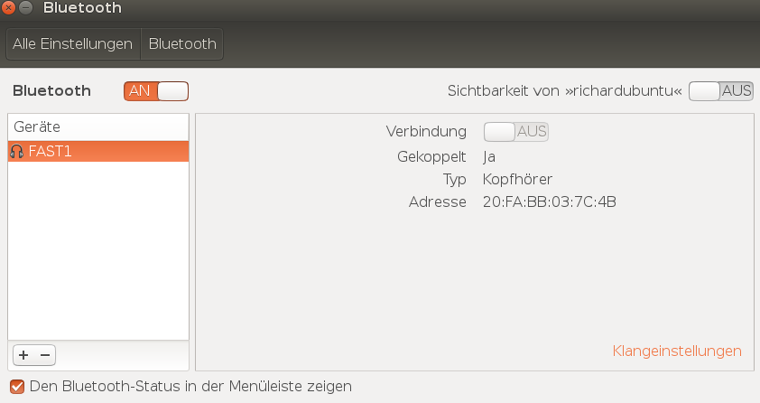

# Repo für das ATM Torus Messgerät

weitere Dokumentation von Richard Fehler befindet sich unter [`./docs`](./docs).

## Installation des mitgelieferten Images (f. Raspi2)

die allgemeine Installation und Anwendung wird in  erläutert. [`./docs/Abschlussbericht_AnhangA.pdf`](./docs/Abschlussbericht_AnhangA.pdf)
Dabei wird das zu flashende Image mit beispielsweise [Balena Etcher](https://www.balena.io/etcher/) analog zum üblichen Vorgang mit Raspbian auf eine SD Karte die im FAT32  Format formatiert sein muss aufgespielt.

### Unter Linux vor dem ersten Booten

Dabei muss anschließend sichergestellt werden, dass kein Installer auf der SD Karte vorhanden ist.
Dieser ist unter `etc/profile.d/install.sh` zu finden, diese Dateien etfernen(SD Karte in Linux mounten).

Anschließend den git repo folder unter `pi/home/git/raspberry` selbst anlegen. 
Die Line Endings der Files anpassen mit [dos2unix](https://linux.die.net/man/1/dos2unix). (Da das zip unter Windows erstellt wurde).
Folgende Befehle in der Shell dabei ausführen: 

```bash
find . -type f -print0 | xargs -0 dos2unix
```

oder Multithreaded

```bash
find . -type f -print0 | xargs -0 -n 1 -P 4 dos2unix 
```

unter `./systemfiles/interfaces` bei Bedarf die Datei auf das Netzwerk anpassen oder entfernen(für DHCP).
eine gute Möglichkeit bietet der Terminal Network Manager `wicd-curses` nach dem ersten booten. Damit können wie in modernen OS einfach mehrere Netzwerke eingestellt werden. (überschreibt die `/etc/network/interface ` Einstellungen)
diese werden dann nach der Installation durch `wicd-curses` überschrieben.

## Git Repo Inhalt

## `./systemfiles/`

Hier sind system services und configs die durch `./install.sh` eingerichtet werden.
zu finden danach unter `/etc/network/` &
`/etc/systemd/system` 
& ... 

Wenn das automatische BT-Audio aufnehmen nicht gewollt ist 
kann vor dem ersten Booten/installieren die Datei 
`./systemfiles/save-bt-audio.service` entfernt werden.
Alternativ nach dem ersten Booten unter `/etc/systemd/` den Service entfernen.

## `./Programs/`

Hier befinden sich die Programme die zur Aufnahme von Daten ausgeführt werden.
das manuelle Aufnehmen von BT-Audio Daten wird durch **`./Programs/control/gpio-event-load-bt-audio.py`** gesteuert.

    arguments for : ./gpio-event-load-bt-audio.py
    startnow: startet Aufnahme sofort (nicht erst auf GPIO Button)
    press long Button for Start of Record
    press long Button for Start/Stop of Record
    Ctrl+C beendet Aufnahme und Programm

## `./install/`

hier befinden sich Skripte zur Installation des BT-Moduls.

### `./install/bt_pair_BC127.exp`

hierzu:
    [BC127 Basics](https://learn.sparkfun.com/tutorials/understanding-the-bc127-bluetooth-module/all)

[Expect Skripting](https://linux.die.net/man/1/expect)

das Skript übernimmt das Pairen via UART Verbindung.

### `./install/raspberry_InCarSensors_and_bt_installer.sh`
...
# Das erste mal Booten
## ausführen des `./install.sh` skripts

**Dabei netzwerk/ internet, und telemetrie/ platine verbindung sicherstellen (via UART /FTDI Adapter).**
Hierbei auf die richtige Polung von VCC und GND und von RX/TX achten. 
Es kann sein, dass das Pairing fehlschlägt.
Dann kann das Skript `./install.sh` erneut aufgerufen werden. nach einem Neustart und eingeschaltetem ATM Modul wird automatisch eine Bluetooth Verbindung aufgebaut.

## SSH Login

Login via `ssh pi@raspberrypi` oder `ssh pi@IP_ADRESSE`
Passwort entweder `pipi1234` oder `raspberry`.

## SSH File Access

    sshfs pi@raspberrypi:DIRECTORY_ON_RASPI DIRECTORY_TO_MOUNT_ON_PC

Mountet mithilfe von FUSE den raspi Ordner wie ein Netzwerklaufwerk.
ermöglicht das direkte editieren von Dateien auf dem Raspi unter MacOS oder Linux. (Zb. mit IDEs oder Spacemacs, VS Code ...)

 Windows Alternativ:

 [WinSCP](https://winscp.net/eng/docs/lang:de)
oder ähnliche tools.
# Hardware

Das ATM Modul wird durch "Schütteln" oder Rotation aktiviert.
 Es kann auch eine Direkte Steckverbindung von Batterie und BC127 zum Dauerbetrieb hergestellt werden. 
 Die BL Verbindung wird automatisch hergestellt.
Dann kann Die BT-Audio bspw. via `./Programs/control/gpio-event-load-bt-audio.py` aufgenommen werden.

# hilfreiche Tools im CLI/Terminal

sudo apt install...

File Manager:

    mc
    ranger

Network Manager:

    wicd-curses

Editors:

    vim
    nano
    emacs

https://vimawesome.com --> Vim Plugins

https://github.com/amix/vimrc --> akzeptable Vim config. ohne YouCompleteMe.

git:

    git-lfs
SSH:

    ssh
    sshfs
Shell:

    zsh
    oh-my-zsh

# Port für Ubuntu / Linux

Hier wird beschrieben wie das ATM Modul zur Audioaufnahme unter Ubuntu oder anderen 
Debian basierten Distributionen einzurichten ist. relevante Dateien sind unter `./PC-Port-Audio-BT` zu finden.

Es ist zu empfehlen einen seperaten PC oder Linux Installation zu verwenden, da 
in den `/` Systemdateien  "gepfuscht" wird und somit das ganze unter Umständen
Probleme bereitet. 

die Installation erfordert das angepasste durchführen von den Skript Bestandteilen:
aus `./install/raspberry_InCarSensors_and_bt_installer.sh`.
Dabei die files unter`/etc/`... gezielt ersetzen durch files aus `./PC-Port-Audio-BT/raspi-bt-files/etc/` wenn sie mit writeout_file aufgerufen werden.
APT_GET_INSTALL von Hand ausführen.
Die Variable `$PI_USER` durch den eigenen Linux User ersetzen.(hier `richard`)

```bash
bt_audio_install()
{
#Installation:
echo "Installing pyaudio for python3 via apt"
APT_GET_INSTALL pulseaudio pulseaudio-utils pulseaudio-module-bluetooth bluez-tools python3-pyaudio moreutils
# moreutils for ts (timestamp)
writeout_file "/etc/bluetooth/audio.conf" nosubst

writeout_file "/etc/bluetooth/main.conf" nosubst append
echo "Allowing pulseaudio to use bluetooth:"
echo 'resample-method=trivial' | sudo tee -a /etc/pulse/daemon.conf

echo "using interrupt methode in udev:"
sudo sed -i 's/load-module module-udev-detect/load-module module-udev-detect tsched=0/g' /etc/pulse/system.pa

#load additional modules for bluetooth
writeout_file "/etc/pulse/system.pa" append nosubst
writeout_file "/etc/systemd/system/pulseaudio.service"

# allow autoconnect via a2dp
#writeout_file "/etc/pulse/default.pa" append nosubst

#rfcomm bind rfcomm0 <dev_id> 
#rfcomm unbind rfcomm0 

#pacat --record -d bluez_source.20_FA_BB_03_7C_4A | sox -t raw -r 44100 -e signed-integer -L -b 16 -c 2 - "output.wav"
# https://github.com/ev3dev/ev3dev/issues/198
# https://bitbucket.org/ehsmaes/raspberry-pi-audio-receiver-install

#restart pulseaudio
sudo systemctl daemon-reload
# enable for run on bootup
sudo systemctl enable pulseaudio.service
sudo systemctl start pulseaudio.service

echo "In die richtige Gruppe hinzufügen"
# will need normally one relogin
sudo usermod -a -G pulse,pulse-access,audio root
sudo usermod -a -G pulse,pulse-access,audio,lp $PI_USER
#or
#$ sudo usermod -a -G lp $PI_USER

#weggelassen unter ubuntu, da bl sowieso hochgefahren wird
writeout_file "/etc/udev/rules.d/10-bluetooth.rules" nosubst
#weggelassen unter ubuntu, da bl sowieso hochgefahren wird
#echo "Reload udev rules"
sudo udevadm control --reload-rules
#sudo service bluetooth restart
#sudo service udev restart
}

configureBTModul()
{
# pair Bluetooth
# syntax: bt_pair_BC127.exp Config_file_for_writing_MAC console for BC127
touch ${USER_CONFIG_FILE}

#hier ein configfile bspw. unter ~/configfile.cfg anlegen
# jetzt analog hierzu, während das ATM Modul via UART verbunden ist!
#richard@richardubuntu:~$ ./bt_pair_BC127.exp configfile.cfg /dev/ttyUSB0 
# das ./bt_pair... skript muss im selben Ordner sein wie die configfile damit es so klappt. 
```

das Skript `./install/bt_pair_BC127.exp` muss auf den neuen Ort der configfile.cfg angepasst werden.

```bash
#!/usr/bin/expect -f
#
# this script will automate the pairing of a bluetooth device with bluez5
# on ttyUSB0 is a BS127 
# start with: ./bt_pair_BC127.exp config_file uart_port
#
# for debug mode:
#exp_internal 1

# set expect timeout
set timeout 15
#log_user 0
set configfile "/home/pi/git/configfile.cfg" #<-- muss angepasst werden. 
# zb. mit /home/richard/configfile.cfg
# max number = 9999 $Digit Pin
# Generating Random pin
set pin [expr {int(rand() * 10000)}]
set baud 9600
set port "/dev/ttyUSB0"
puts "pin: <$pin>\r"
.....
```
weiter mit dem `./install/raspberry_InCarSensors_and_bt_installer.sh` Skript:

```bash
${INSTALL_BT_SCRIPT} ${USER_CONFIG_FILE} ${SERIAL_AUDIO_CONSOLE}
if [ $? -ne 0 ]; then
    return
fi

#resource file:
source ${USER_CONFIG_FILE}
#----->autostart recording on connect------
echo "Autostart Recording when Bluetooth device gets connected."
#http://www.instructables.com/id/Turn-your-Raspberry-Pi-into-a-Portable-Bluetooth-A/

# writeout_file "/etc/udev/rules.d/99-input.rules"
# sudo udevadm control --reload-rules

echo "RF_TTY=\"rfcomm0\"" >> ${USER_CONFIG_FILE}
writeout_file "/etc/bluetooth/rfcomm.conf"

# weglassen da wir manuell die Aufnahme starten und beenden wollen.
# writeout_file "/etc/systemd/system/${BT_SYSTEMD_SERVICE}" 
# sudo systemctl enable ${BT_SYSTEMD_SERVICE}
# sudo systemctl daemon-reload
# srv=(${BT_SYSTEMD_SERVICE/./ })
# sudo systemctl status $srv
}
``` 
Nun sollte nach einem Neustart das Gerät im BL Manager sichtbar sein wie hier:



## manuelle Aufnahme starten

durch aufrufen des Programms: `./Programs/bt_audo_recorder.py` wie folgt lässt sich
eine Aufnahme starten.
Dabei kann diese mit Strg+C oder SIGINT beendet werden. 

    python3 bt_audo_recorder.py ./audiolog/ 2>&1

eine `.gz` Datei unter `./audiolog` wird erstellt mit der enstprechenden `.wav` Datei.
dafür muss die Bluetooth Verbindung sichergestellt werden. 
(Blaue LED blinkt, Testaufnahme).
wenn die Verbindung nicht vorhanden ist kann diese mit 

    $ bluetoothctl
    [bluetooth]# connect 20:FA:BB:03:7C:4B 

hergestellt werden. dabei muss 20:FA... durch die korrekte MAC Adresse ersetzt werden 
wenn ein anderes Modul verwendet wird. Dies funktioniert im Gegensatz zum BL Manager zuverlässiger.

